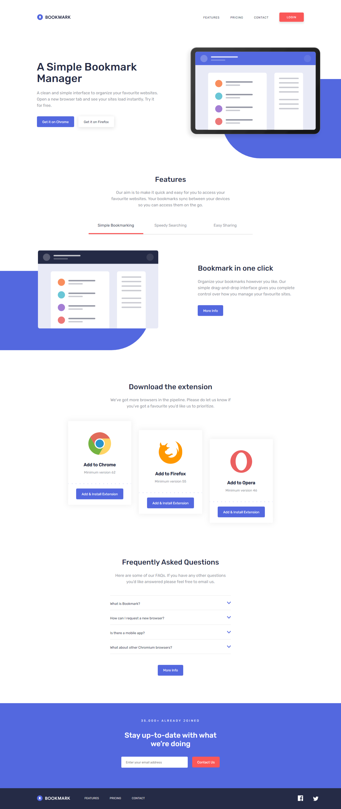

# Frontend Mentor - Bookmark landing page solution

This is a solution to the [Bookmark landing page challenge on Frontend Mentor](https://www.frontendmentor.io/challenges/bookmark-landing-page-5d0b588a9edda32581d29158). Frontend Mentor challenges help you improve your coding skills by building realistic projects. 

## Overview

### The challenge

Users should be able to:

- View the optimal layout for the site depending on their device's screen size
- See hover states for all interactive elements on the page

### Screenshot

This is my website's desktop view

I did not include the mobile preview since it is long

### Links

- Live Site URL: [Live site of the challenge hosted here]https://pikapikamart.github.io/frontendmentor-bookmark/)

## My process

Hello, this is my 20th challenge from frontendmentor. This challenge was really fun to do. The hardest part for me was the ui (of course), especially the two blue background that is behind the hero section and in the feature section. I wanted to add some animations here and there but I thought that this site doesn't really needed to be flashy of some sort. 
Accessibility as well is hard but I think I managed to make it good and accessible for people, especially on the feature section as it is implemented as a tabbed interface. Thank you checking this one out^^

### Built with

- Semantic HTML5 markup
- Javascript
- CSS custom properties
- Flexbox
- CSS Grid
- Mobile-first workflow
- Gulp for pre-processing and server

### What I learned

I learned to make tabbed intefaces especially on the feature section of this challenge. 

### Continued development

I will now continue developing more sites using mobile first workflow. I also want to learn now a frontend framework, but still, I have some doubts if I am ready.

## Author

- Website - Well I haven't made my profile portfolio, gonna make it sooon when I know a lot of stuffs
- Frontend Mentor - [@pikamart](https://www.frontendmentor.io/profile/pikamart)
- Twitter - [@RaymartPamplona](https://twitter.com/RaymartPamplona)